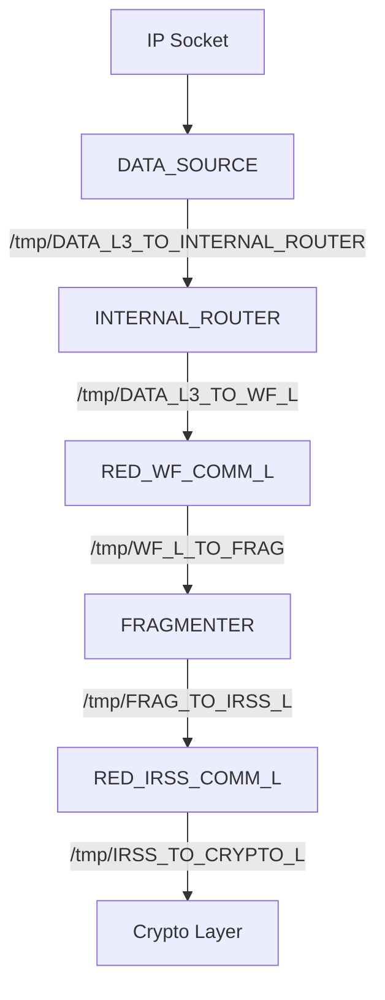

# SCA Data Flow

This document describes the data flow through the system components via Unix domain sockets.

## Edge Lists

### Transmit Path (TX)

| Hop | Process Name    | Input Socket                      | Output Socket                    |
|-----|-----------------|-----------------------------------|----------------------------------|
| 1   | DATA_SOURCE     | IP socket                         | /tmp/DATA_L3_TO_INTERNAL_ROUTER  |
| 2   | INTERNAL_ROUTER | /tmp/DATA_L3_TO_INTERNAL_ROUTER   | /tmp/DATA_L3_TO_WF_L             |
| 3   | RED_WF_COMM_L   | /tmp/DATA_L3_TO_WF_L              | /tmp/WF_L_TO_FRAG                |
| 4   | FRAGMENTER      | /tmp/WF_L_TO_FRAG                 | /tmp/FRAG_TO_IRSS_L              |
| 5   | RED_IRSS_COMM_L | /tmp/FRAG_TO_IRSS_L               | /tmp/IRSS_TO_CRYPTO_L            |

### Receive Path (RX)

| Hop | Process Name    | Input Socket                     | Output Socket                     |
|-----|-----------------|----------------------------------|-----------------------------------|
| 6   | RED_IRSS_COMM_L | /tmp/FRAG_TO_IRSS_L              | /tmp/IRSS_L_TO_FRAG               |
| 7   | FRAGMENTER      | /tmp/IRSS_L_TO_FRAG              | /tmp/FRAG_TO_COMM_WF_L            |
| 8   | RED_WF_COMM_L   | /tmp/FRAG_TO_COMM_WF_L           | /tmp/DATA_L_TO_SINK               |

## Flowcharts

### Transmit Path (TX)



### Receive Path (RX)

```mermaid
flowchart TD
    FRAG_TO_IRSS_L[/tmp/FRAG_TO_IRSS_L] --> RED_IRSS_COMM_L[RED_IRSS_COMM_L]
    RED_IRSS_COMM_L -->|/tmp/IRSS_L_TO_FRAG| FRAGMENTER[FRAGMENTER]
    FRAGMENTER -->|/tmp/FRAG_TO_COMM_WF_L| RED_WF_COMM_L[RED_WF_COMM_L]
    RED_WF_COMM_L -->|/tmp/DATA_L_TO_SINK| DATA_SINK[DATA_SINK]
```

## Notes

- All socket paths use Unix domain sockets
- Data flows through multiple processes via intermediate sockets
- SCA (System Communication Analyzer) traces traffic on these sockets


## Taking the latancy based on NNG packet REQ/REP timestamp difference

The data are sent in the following packet NNG/SCA format:

| NNG SPF  | Protocol (REQ/REP) | MSG Type  | Size | Payload |
|----------|--------------------|-----------|------|---------|
|    9B    |        4B          |    2B     |  2B  |         |

where we skip the first 9 bytes and focus on the protocol REQ/REP 4 bytes and the MSG Type 2 bytes.
On sending to the listening socket from previous component in the data flow chain, we map a key made of the combined Protocol (REQ/REP) and MSG Type to its timestamp value.
Then on sending back over the same socket we check the map with combined key of Protocol (REQ/REP) and MSG Type + 1 field and tame thier timestamps difference as a latancy for process id

### Update (Current Architecture)

The SCA program now traces `sys_enter_sendmsg` syscalls on specific Unix domain sockets to measure latency for each hop in the data flow chain.

#### Latency Measurement Approach

For each tracked socket hop, the program:
1. Reads the **Protocol field** from the NNG packet payload (offset 9 in the SPF header)
2. Uses this Protocol value as the key for timestamp tracking
3. When the sending process sends TO the socket: stores timestamp with Protocol as key
4. When the receiving process sends FROM that socket: looks up timestamp with Protocol as key
5. Calculates latency as: `current_timestamp - stored_timestamp`

#### Socket Hops Configuration

The following socket hops are configured for latency measurement:

| Socket Path                       | Listening Process (Receiver) | Sending Process (Sender) | Latency Tracked |
|-----------------------------------|------------------------------|--------------------------|-----------------|
| `/tmp/DATA_L3_TO_INTERNAL_ROUTER` | INTERNAL_ROUTER              | DATA_SOURCE              | DATA_SOURCE → INTERNAL_ROUTER |
| `/tmp/DATA_L3_TO_WF_L`            | RED_WF_COMM_L                | INTERNAL_ROUTER          | INTERNAL_ROUTER → RED_WF_COMM_L |
| `/tmp/WF_L_TO_FRAG`               | FRAGMENTER                   | RED_WF_COMM_L            | RED_WF_COMM_L → FRAGMENTER |
| `/tmp/FRAG_TO_IRSS_L`             | RED_IRSS_COMM_L              | FRAGMENTER               | FRAGMENTER → RED_IRSS_COMM_L |

#### Implementation Details

1. **Socket Hops Map** (`SOCKET_HOPS_MAP`):
   - Key: socket path string (`[u8; 64]`)
   - Value: SocketHopInfo with sending/receiving process names
   - Populated at program load time from `SOCKET_HOPS` configuration

2. **Timestamp Tracking** (`TIMESTAMP_MAP`):
   - Key: Protocol (u64) from NNG packet payload
   - Value: timestamp in nanoseconds
   - When `DATA_SOURCE` sends to `/tmp/DATA_L3_TO_INTERNAL_ROUTER`: stores timestamp with Protocol key
   - When `INTERNAL_ROUTER` sends from `/tmp/DATA_L3_TO_INTERNAL_ROUTER`: looks up timestamp with Protocol key, calculates latency

3. **Moving Average**: Latencies are tracked using a sliding window (2-second window) with sum and count per process.

#### eBPF Map Structure

| Map Name              | Key Type      | Value Type    | Purpose |
|-----------------------|---------------|---------------|--------|
| `SOCKET_HOPS_MAP`     | `[u8; 64]`    | `SocketHopInfo` | Maps socket paths to sending/receiving process info |
| `TIMESTAMP_MAP`       | `u64` (Protocol) | `u64` (timestamp) | Stores timestamps keyed by NNG Protocol field |
| `LATENCY_PNAME_SUM`   | `[u8; 16]` (process name) | `u64` | Sum of latencies per process |
| `LATENCY_PNAME_COUNT` | `[u8; 16]` (process name) | `u64` | Count of samples per process |
