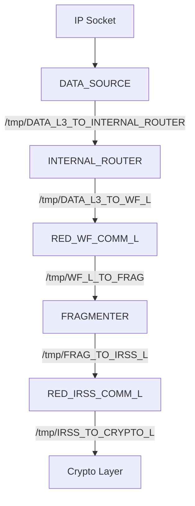

# SCA Data Flow

This document describes the data flow through the system components via Unix domain sockets.

## Edge Lists

### Transmit Path (TX)

| Hop | Process Name    | Input Socket                      | Output Socket                    |
|-----|-----------------|-----------------------------------|----------------------------------|
| 1   | DATA_SOURCE     | IP socket                         | /tmp/DATA_L3_TO_INTERNAL_ROUTER  |
| 2   | INTERNAL_ROUTER | /tmp/DATA_L3_TO_INTERNAL_ROUTER   | /tmp/DATA_L3_TO_WF_L             |
| 3   | RED_WF_COMM_L   | /tmp/DATA_L3_TO_WF_L              | /tmp/WF_L_TO_FRAG                |
| 4   | FRAGMENTER      | /tmp/WF_L_TO_FRAG                 | /tmp/FRAG_TO_IRSS_L              |
| 5   | RED_IRSS_COMM_L | /tmp/FRAG_TO_IRSS_L               | /tmp/IRSS_TO_CRYPTO_L            |

### Receive Path (RX)

| Hop | Process Name    | Input Socket                     | Output Socket                     |
|-----|-----------------|----------------------------------|-----------------------------------|
| 6   | RED_IRSS_COMM_L | /tmp/FRAG_TO_IRSS_L              | /tmp/IRSS_L_TO_FRAG               |
| 7   | FRAGMENTER      | /tmp/IRSS_L_TO_FRAG              | /tmp/FRAG_TO_COMM_WF_L            |
| 8   | RED_WF_COMM_L   | /tmp/FRAG_TO_COMM_WF_L           | /tmp/DATA_L_TO_SINK               |

## Flowcharts

### Transmit Path (TX)



### Receive Path (RX)

```mermaid
flowchart TD
    FRAG_TO_IRSS_L[/tmp/FRAG_TO_IRSS_L] --> RED_IRSS_COMM_L[RED_IRSS_COMM_L]
    RED_IRSS_COMM_L -->|/tmp/IRSS_L_TO_FRAG| FRAGMENTER[FRAGMENTER]
    FRAGMENTER -->|/tmp/FRAG_TO_COMM_WF_L| RED_WF_COMM_L[RED_WF_COMM_L]
    RED_WF_COMM_L -->|/tmp/DATA_L_TO_SINK| DATA_SINK[DATA_SINK]
```

## Notes

- All socket paths use Unix domain sockets
- Data flows through multiple processes via intermediate sockets
- SCA (System Communication Analyzer) traces traffic on these sockets