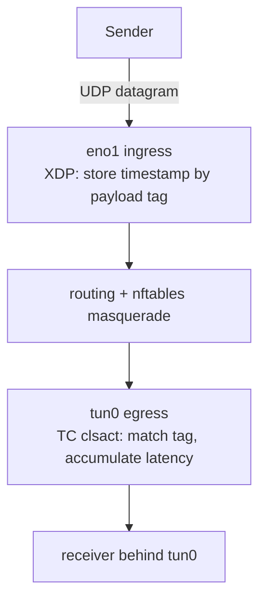

# IFLAT

IFLAT measures the interface-to-interface forwarding latency of UDP
datagrams: how long the kernel holds one datagram from ingress on the RX
interface (e.g. `eno1`) to egress on the TX interface (e.g. `tun0`). The
forwarding path may apply NAT (nftables masquerade, see
`/etc/nftables.conf`): addresses, ports and checksums are rewritten, but the
payload is not, so each datagram is correlated by the tag in its first 4
payload bytes (big-endian) — the same key before and after NAT.

### Data Flow



#### Latency Measurement Approach

1. On ingress (`iflat_xdp_rx`, XDP on `rx_iface`, pre-NAT): parse
   Ethernet/IPv4/UDP and store `TIMESTAMP_MAP[tag] = bpf_ktime_get_ns()`
2. On egress (`iflat_tc_tx`, TC clsact egress on `tx_iface`, post-NAT): parse
   IPv4/UDP (a tun device has no L2 header) and look up the tag; on a match
   remove the record and add the latency to the
   `LATENCY_SUM`/`LATENCY_COUNT` accumulators
3. Userspace turns the accumulators into a periodic moving average

### Measurement points

| Program | Hook | Role |
|---------|------|------|
| `iflat_xdp_rx` | XDP on `rx_iface` | RX: store the receipt timestamp keyed by the payload tag (first 4 UDP payload bytes, big-endian). Runs before routing and netfilter |
| `iflat_tc_tx` | TC clsact egress on `tx_iface` | TX: match the tag; on a hit compute `now - stored`, accumulate, remove. Runs after POSTROUTING, before the egress qdisc |

The measured span is the pure in-kernel forwarding path: stack input,
routing, netfilter (including NAT) and the hand-off to the egress device.
Delay introduced by the egress qdisc itself (e.g. tc-netem on the TX
interface) is *after* the TX hook and therefore not included.

`TIMESTAMP_MAP` is an LRU hash map: datagrams whose tag never matches
(foreign traffic sharing a tag prefix, drops on the forwarding path) cannot
fill it.

### Maps

| Map | Key | Value | Purpose |
|-----|-----|-------|---------|
| `TIMESTAMP_MAP` (LRU) | payload tag (u32) | RX timestamp (ns) | matched and removed by TX |
| `LATENCY_SUM` | 0 | cumulative latency sum (ns) | userspace moving average |
| `LATENCY_COUNT` | 0 | cumulative sample count | userspace moving average |

### Moving average and metric

The accumulators are cumulative since program load; userspace converts them
to per-tick deltas and averages each 3-second display tick, so the reported
latency is a periodic moving average that reflects recent traffic. A tick
with no matched datagrams reports 0.

- `iflat_avg_latency_us` (gauge): average interface-to-interface forwarding
  latency in microseconds over the last display interval

### Configuration

Both interfaces are required settings; without them the program logs a
warning and stays disabled (so an implicit "enable all programs" config
cannot fail the agent):

```toml
[[ebpf_programs]]
name = "iflat"
enabled = true

[ebpf_programs.settings]
rx_iface = "eno1"   # ingress interface (XDP)
tx_iface = "tun0"   # egress interface (TC clsact egress)
```

The XDP program first tries native (driver) mode and falls back to generic
(SKB) mode when the NIC driver has no XDP support. The userspace handler
adds the `clsact` qdisc on `tx_iface` before attaching.

### Limitations

- IPv4 and UDP only; no VLAN tags, no IP fragmentation handling
- The RX side expects an Ethernet header (XDP on a L2 interface), the TX
  side expects a bare IP packet (TC on a L3/tun interface)
- Datagrams must carry a unique 4-byte prefix in their payload to be
  correlated; identical tags in flight simultaneously alias to the latest
  RX timestamp

### Simulator

`bpfagent/examples/iflat_sim.rs` builds the whole data flow on one machine
(locally generated packets never pass XDP ingress, so a real link is
simulated with a network namespace and a veth pair):

- host end of the veth pair (`veth-iflat0`, 192.168.100.1/24) plays the
  role of the production RX interface
- `tun0` (10.200.0.1/24) is the TX interface; the simulator keeps the tun
  fd open and reads the forwarded datagrams back
- nftables masquerade towards tun0 mirrors the production
  `/etc/nftables.conf` setup (dedicated table `iflat-sim`)
- the simulator re-executes itself inside the namespace and sends a UDP
  datagram to 10.200.0.2 every 500 ms, each carrying a random 4-byte tag
  plus its CLOCK_MONOTONIC send timestamp
- per received datagram it prints the userspace send-to-receive latency —
  a superset of the agent's in-kernel span (it also covers the
  netns → veth delivery), so the sim's values are the upper bound for
  `iflat_avg_latency_us`

```bash
cargo build --example iflat_sim
sudo ./target/debug/examples/iflat_sim            # needs root, iproute2, nftables
sudo ./target/debug/examples/iflat_sim 10         # + 10 ms netem delay in the namespace
# agent with the config snippet the sim prints at startup:
sudo ./target/debug/bpfagent -f /path/to/iflat.conf
curl http://localhost:9101/metrics | grep iflat_avg_latency_us
```

With a netem delay the userspace latency grows by that amount while the
agent's in-kernel span does not — demonstrating that IFLAT isolates the
forwarding path. SIGINT tears down the namespace, veth pair, nft table and
tun device.
