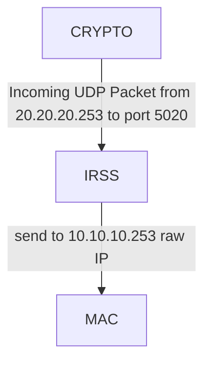

# IRSS

This document describes the data flow through the IRSS components receiving UDP data and sending it via Raw IP

### Transmit Path (TX)



#### Latency Measurement Approach

1. For imcoming data, we store its timestamp as a map value for key based on its first 4 bytes
2. For outgoing date, we're trying to match its first 4 bytes as a key in that map. If it matched we calculade their timestamps difference as a latency and store it for periodic moving average calculation and drop its map record

It's like SCA, but simpler: no need to filter PID and FD with ss and lsof. Just focus receiving and sending

## Implementation

The IRSS eBPF program (`ebpf/irss/`) hooks three syscall tracepoints; the
userspace handler is `bpfagent/src/programs/irss/`.

### eBPF hooks

| Program | Hook | Role |
|---------|------|------|
| `irss_udp_recvmsg` | kprobe on `udp_recvmsg` | RX filter: read the receiving socket's local port (sk_num); if it matches the configured listen port, stash the user_msghdr pointer in `RECV_MSG_PTR` (keyed by pid_tgid). Covers every UDP receive variant (recvmsg/recvfrom/recv/read) |
| `irss_sys_exit_recvmsg` | `syscalls:sys_exit_recvmsg` | RX: read the payload tag (first 4 payload bytes, big-endian) from the now-filled buffer and store `TIMESTAMP_MAP[tag] = bpf_ktime_get_ns()` |
| `irss_sys_enter_sendmsg` | `syscalls:sys_enter_sendmsg` | TX: if the sendmsg() destination matches the configured raw-IP destination, look up the payload tag in `TIMESTAMP_MAP`; on a match remove it and add the latency to the `LATENCY_SUM`/`LATENCY_COUNT` accumulators |

The payload tag is read from the first iovec of the msghdr, which must be at
least 4 bytes long. Both filters are runtime-configurable (see Configuration
below); their values live in BPF maps written by userspace at load time,
with compiled-in defaults as fallback:

- RX: the kprobe reads `sk->sk_num` (offset 14 in `struct sock`, a layout
  stable for decades) and accepts only the configured listen port
  (LISTEN_PORT_MAP, default `irss_common::LISTEN_PORT` = 5020).
- TX: the sendmsg() msg_name sockaddr is checked for `sin_family == AF_INET`
  and `sin_addr` equal to the configured destination (RAW_DEST_MAP, default
  `irss_common::RAW_DEST` = 10.10.10.253). A connected raw socket (no
  msg_name) is not matched.

This keeps unrelated recvmsg()/sendmsg() traffic on the host from polluting
the measurement — no PID/FD discovery is needed (unlike SCA).

### Maps

| Map | Key | Value | Purpose |
|-----|-----|-------|---------|
| `RECV_MSG_PTR` | pid_tgid | user_msghdr pointer | kprobe → sys_exit handoff for recvmsg |
| `TIMESTAMP_MAP` | payload tag (u32) | RX timestamp (ns) | matched and removed by TX |
| `LATENCY_SUM` | 0 | cumulative latency sum (ns) | userspace moving average |
| `LATENCY_COUNT` | 0 | cumulative sample count | userspace moving average |
| `RAW_DEST_MAP` | 0 | configured raw-IP destination (u32) | TX filter input, written by userspace at load (default 10.10.10.253) |
| `LISTEN_PORT_MAP` | 0 | configured UDP listen port (u32) | RX filter input, written by userspace at load (default 5020) |

### Moving average and metric

The accumulators are cumulative since program load; userspace converts them
to per-tick deltas and averages each 3-second display tick, so the reported
latency is a periodic moving average that reflects recent traffic. A tick
with no matched datagrams reports 0.

- `irss_avg_latency_us` (gauge): average UDP-to-raw-IP forwarding latency in
  microseconds over the last display interval

### Configuration

Both filters default to the data flow above and can be changed per
deployment:

```toml
[[ebpf_programs]]
name = "irss"
enabled = true

[ebpf_programs.settings]
listen_port = 5020
raw_dest = "10.10.10.253"
```

Userspace writes both values into `LISTEN_PORT_MAP`/`RAW_DEST_MAP` at load
time; the eBPF filters read them from the maps (falling back to the
compiled-in defaults when the map entries are absent). Invalid or missing
values fall back to the defaults.


### Simulator

`bpfagent/examples/irss_sim.rs` simulates the data flow on one machine:
a CRYPTO thread sends UDP datagrams with a random 4-byte tag to port 5020
once per second; the IRSS thread receives them with recvmsg(), waits 12 ms
(simulated processing), and forwards the payload with sendmsg() over a raw
IP socket (protocol 253) to 10.10.10.253.

```bash
cargo build --example irss_sim
sudo ./target/debug/examples/irss_sim                      # raw sockets need CAP_NET_RAW
sudo ./target/debug/examples/irss_sim 10.10.10.99          # custom raw destination
sudo ./target/debug/examples/irss_sim 10.10.10.253 5051    # custom listen port
sudo ./target/debug/bpfagent            # irss enabled in bpfagent.conf
curl http://localhost:9101/metrics | grep irss_avg_latency_us
```

The sys_enter_sendmsg tracepoint fires before routing, so the measurement
works even when 10.10.10.253 is unreachable on the test machine; the sim
logs such send errors and continues. Note that the sim's UDP delivery
requires the host firewall to accept the traffic (e.g. an open loopback or
the used subnet).
