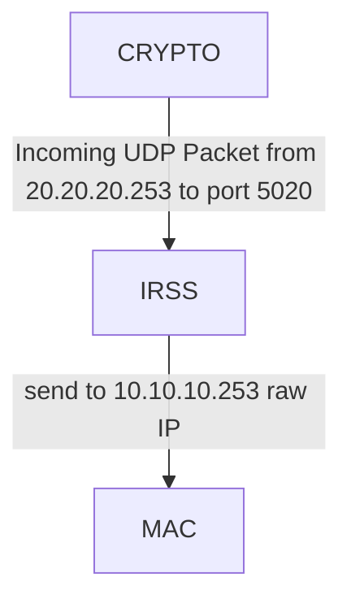

# IRSS

This document describes the data flow through the IRSS components receiving UDP data and sending it via Raw IP

### Transmit Path (TX)

#### Latency Measurement Approach

1. For imcoming data, we store its timestamp as a map value for key based on its first 4 bytes
2. For outgoing date, we're trying to match its first 4 bytes as a key in that map. If it matched we calculade their timestamps difference as a latency and store it for periodic moving average calculation and drop its map record

It's like SCA, but simpler: no need to filter PID and FD with ss and lsof. Just focus receiving and sending
