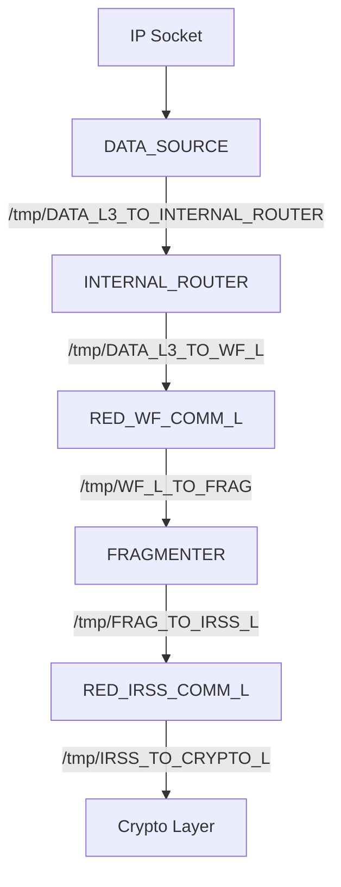

# SCA Data Flow

This document describes the data flow through the system components via Unix domain sockets.

## Edge Lists

### Transmit Path (TX)

| Hop | Process Name    | Input Socket                      | Output Socket                    |
|-----|-----------------|-----------------------------------|----------------------------------|
| 1   | DATA_SOURCE     | IP socket                         | /tmp/DATA_L3_TO_INTERNAL_ROUTER  |
| 2   | INTERNAL_ROUTER | /tmp/DATA_L3_TO_INTERNAL_ROUTER   | /tmp/DATA_L3_TO_WF_L             |
| 3   | RED_WF_COMM_L   | /tmp/DATA_L3_TO_WF_L              | /tmp/WF_L_TO_FRAG                |
| 4   | FRAGMENTER      | /tmp/WF_L_TO_FRAG                 | /tmp/FRAG_TO_IRSS_L              |
| 5   | RED_IRSS_COMM_L | /tmp/FRAG_TO_IRSS_L               | /tmp/IRSS_TO_CRYPTO_L            |

### Receive Path (RX)

| Hop | Process Name    | Input Socket                     | Output Socket                     |
|-----|-----------------|----------------------------------|-----------------------------------|
| 6   | RED_IRSS_COMM_L | /tmp/FRAG_TO_IRSS_L              | /tmp/IRSS_L_TO_FRAG               |
| 7   | FRAGMENTER      | /tmp/IRSS_L_TO_FRAG              | /tmp/FRAG_TO_COMM_WF_L            |
| 8   | RED_WF_COMM_L   | /tmp/FRAG_TO_COMM_WF_L           | /tmp/DATA_L_TO_SINK               |

## Flowcharts

### Transmit Path (TX)



### Receive Path (RX)

```mermaid
flowchart TD
    FRAG_TO_IRSS_L[/tmp/FRAG_TO_IRSS_L] --> RED_IRSS_COMM_L[RED_IRSS_COMM_L]
    RED_IRSS_COMM_L -->|/tmp/IRSS_L_TO_FRAG| FRAGMENTER[FRAGMENTER]
    FRAGMENTER -->|/tmp/FRAG_TO_COMM_WF_L| RED_WF_COMM_L[RED_WF_COMM_L]
    RED_WF_COMM_L -->|/tmp/DATA_L_TO_SINK| DATA_SINK[DATA_SINK]
```

## Notes

- All socket paths use Unix domain sockets
- Data flows through multiple processes via intermediate sockets
- SCA (Socket Communication Analyzer) traces traffic on these sockets


## Taking the latancy based on NNG packet REQ/REP timestamp difference

> **Note:** This section describes the original, superseded timestamp-keying
> design and is kept for historical context. See
> [Update (Current Architecture)](#update-current-architecture) below for the
> current implementation.

The data are sent in the following packet NNG/SCA format:

| NNG SPF  | Protocol (REQ/REP) | MSG Type  | Size | Payload |
|----------|--------------------|-----------|------|---------|
|    9B    |        4B          |    2B     |  2B  |         |

where we skip the first 9 bytes and focus on the protocol REQ/REP 4 bytes and the MSG Type 2 bytes.
On sending to the listening socket from previous component in the data flow chain, we map a key made of the combined Protocol (REQ/REP) and MSG Type to its timestamp value.
Then on sending back over the same socket we check the map with combined key of Protocol (REQ/REP) and MSG Type + 1 field and tame thier timestamps difference as a latancy for process id

### Update (Current Architecture)

The SCA program now traces `sys_enter_sendmsg` syscalls on specific Unix domain sockets to measure latency for each hop in the data flow chain.

#### Latency Measurement Approach

For each tracked socket hop, the program:
1. Reads the **Protocol field** from the NNG packet payload (offset 9 in the SPF header)
2. Uses a combined key of **hop index + Protocol** for timestamp tracking
3. When the sending process sends TO the socket: stores timestamp with `(hop_index << 32) | Protocol` as key
4. When the receiving process sends FROM that socket: looks up the timestamp with the same key
5. Calculates latency as: `current_timestamp - stored_timestamp`

#### Socket Hops Configuration

The following socket hops are configured for latency measurement:

| Socket Path                       | Listening Process (Receiver) | Sending Process (Sender) | Latency Tracked |
|-----------------------------------|------------------------------|--------------------------|-----------------|
| `/tmp/DATA_L3_TO_INTERNAL_ROUTER` | INTERNAL_ROUTER              | DATA_SOURCE              | DATA_SOURCE → INTERNAL_ROUTER |
| `/tmp/DATA_L3_TO_WF_L`            | RED_WF_COMM_L                | INTERNAL_ROUTER          | INTERNAL_ROUTER → RED_WF_COMM_L |
| `/tmp/WF_L_TO_FRAG`               | FRAGMENTER                   | RED_WF_COMM_L            | RED_WF_COMM_L → FRAGMENTER |
| `/tmp/FRAG_TO_IRSS_L`             | RED_IRSS_COMM_L              | FRAGMENTER               | FRAGMENTER → RED_IRSS_COMM_L |
| `/tmp/IRSS_L_TO_FRAG`             | FRAGMENTER                   | RED_IRSS_COMM_L          | RED_IRSS_COMM_L → FRAGMENTER |
| `/tmp/FRAG_TO_COMM_WF_L`          | RED_WF_COMM_L                | FRAGMENTER               | FRAGMENTER → RED_WF_COMM_L |
| `/tmp/DATA_L_TO_SINK`             | DATA_SINK                    | RED_WF_COMM_L            | RED_WF_COMM_L → DATA_SINK |

#### Implementation Details

1. **Socket Hops Map** (`SOCKET_HOPS_MAP`):
   - Key: `(pid << 32) | fd` (u64) — unambiguous because fd numbers are per-process
   - Value: `HopEndpoint { hop_index, is_sender, path }` — `path` is the hop's
     Unix socket path (NUL-padded `[u8; 32]`, for logging)
   - Populated at program load time: each hop contributes up to two entries —
     the sender's connected fd and the receiver's accepted fd.
   - Discovery uses `ss -xpH` peer-inode pairing: the receiver's accepted socket
     carries the hop path directly; the sender's connected socket (which has no
     path of its own) is resolved to a hop via its peer inode.

2. **Timestamp Tracking** (`TIMESTAMP_MAP`):
   - Key: `(hop_index << 32) | Protocol` (u64)
   - Value: timestamp in nanoseconds
   - When e.g. `DATA_SOURCE` sends to `/tmp/DATA_L3_TO_INTERNAL_ROUTER`: stores
     timestamp with the hop key
   - When `INTERNAL_ROUTER` sends back on the same hop: looks up the timestamp
     with the same key and calculates the latency

3. **Moving Average**: Latencies are aggregated per receiving PID with a sliding
   window (2-second window) using sum and count maps.

#### eBPF Map Structure

| Map Name              | Key Type      | Value Type    | Purpose |
|-----------------------|---------------|---------------|--------|
| `SOCKET_HOPS_MAP`     | `u64` ((pid << 32) \| fd) | `HopEndpoint` | Maps hop endpoints to (hop index, sender/receiver role) |
| `TRACEPOINT_COUNTER`  | `u32` (always 0)  | `u64` | Diagnostic count of tracepoint invocations |
| `TIMESTAMP_MAP`       | `u64` ((hop_index << 32) \| Protocol) | `u64` (timestamp) | Stores timestamps per hop keyed by NNG Protocol field |
| `LATENCY_PID_SUM`     | `u32` (PID)   | `u64` | Sum of latencies per receiving process |
| `LATENCY_PID_COUNT`   | `u32` (PID)   | `u64` | Count of samples per receiving process |
| `LATENCY_WINDOW_START` | `u32` (PID)  | `u64` (timestamp) | Start timestamp of the current 2-second sliding window per receiving process |
